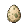
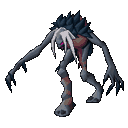
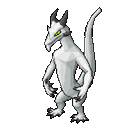
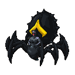
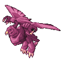
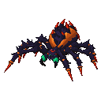
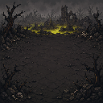
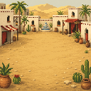
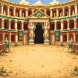
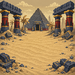

<p align="center">
  
</p>

<h1 align="center">Gieligotchi</h1>

<p align="center">
  <strong>A tiny life in Gielinor.</strong><br>
  Hatch, raise and remember a companion while you play Old School RuneScape.
</p>

<p align="center">
  <a href="https://discord.gg/dP9WN62QQE">Join the Discord</a>
  &nbsp;&bull;&nbsp;
  <a href="#how-it-works">How it works</a>
  &nbsp;&bull;&nbsp;
  <a href="#privacy-and-fair-play">Privacy &amp; fair play</a>
</p>

<p align="center">
  
  
  
  
  
</p>

## What is Gieligotchi?

Gieligotchi is a cosy, cosmetic companion game for RuneLite. You begin with an
egg, choose a companion to raise and let your normal adventures in Gielinor
shape the life you build together.

Your companion grows as you play. It develops a personality, makes wishes,
discovers favourite toys and keeps a small memory book of your time together.
There are no daily streaks, no punishment for taking a break and no companion
death. Gieligotchi is designed to add a little warmth to RuneScape without
turning it into another list of chores.

## How it works

1. **Choose an egg.** Each new journey begins with a mystery companion.
2. **Play RuneScape normally.** Skilling, combat, quests and recognised
   activities help your egg and companion grow.
3. **Welcome your hatchling.** Discover its species, colour and personality.
4. **Make it yours.** Build affection, grant wishes, play with familiar
   Gielinor toys and collect backdrops for its home.
5. **Keep the memories.** Raise companions over time and build a collection of
   the little lives that travelled with you.

Gieligotchi keeps some discoveries behind the journey itself. The guide explains
what to expect without turning every hatch, wish or reward into a spreadsheet.

## A companion with a life of its own

- **71 companion species** and **781 collectible colour variants**
- Individual personalities, wishes, favourite toys and affection
- A persistent memory book for meaningful moments
- Animated hatching and a history of every companion you have raised
- A special red partyhat for companions that reach max level
- A compact Tamagotchi-inspired sidebar and an optional movable in-game overlay

## Familiar places, made for your companion

Collect hand-crafted interpretations of recognisable Gielinor locations. Each
scene is inspired by the game while leaving a clear little place at its centre
for your active companion.

<p align="center">
  
  
  
  
</p>

From Lumbridge and Falador to Prifddinas, Morytania and the Wilderness, the
collection turns familiar settings into small homes rather than literal game
screenshots.

## Care, play and collect

Spend Gotchi Points on permanent cosmetic unlocks, then choose the home and toy
that suit your companion. Toys use familiar Old School RuneScape items such as
the gnomeball, Jad plush and hand fan. Cosmetics and progression belong only to
Gieligotchi: they never change your character, items, XP, drops or pet ownership
in RuneScape.

## Built to stay out of your way

Gieligotchi is meant to sit alongside the game, not compete with it.

- Take breaks whenever you like; nothing decays while you are away.
- Move or disable the in-game overlay at any time.
- Use reduced-motion options for a quieter presentation.
- Keep separate progress for each RuneLite profile.
- Play without accounts, external services or cloud storage.

## Privacy and fair play

All Gieligotchi progress is stored locally in a profile file managed by the
plugin.
The plugin does not ask for RuneScape credentials, send your companion data to a
third-party server, inject input or automate gameplay. It listens to RuneLite
events only to recognise ordinary play and update its own cosmetic companion.

The companion is a RuneLite interface element, not an in-world NPC, and provides
no gameplay advantage.

## Installation status

Gieligotchi has been submitted for RuneLite Plugin Hub review. It is not yet
available through the Plugin Hub; its submission can be followed in
[Plugin Hub pull request #16119](https://github.com/runelite/plugin-hub/pull/16119).

## Community

Questions, hatch stories, feedback and companion screenshots are welcome in the
[Gieligotchi Discord](https://discord.gg/dP9WN62QQE).

<details>
<summary><strong>Development</strong></summary>

Gieligotchi targets Java 11 and uses RuneLite's standard Plugin Hub build.

```powershell
.\gradlew.bat clean test
.\gradlew.bat run
```

The development client uses isolated in-memory preferences. Jagex account login
setup follows RuneLite's standard external-plugin workflow.

</details>

## Artwork and attribution

Companion and backdrop artwork was created specifically for Gieligotchi with
AI-assisted tools. Familiar toy and partyhat graphics are rendered from
RuneLite-provided Old School RuneScape item assets at runtime.

We would love to collaborate with Old School RuneScape artists who are
interested in replacing or refining the AI-assisted imagery throughout
Gieligotchi. If that sounds like you, please reach out through the
[Gieligotchi Discord](https://discord.gg/dP9WN62QQE).

The idea of rewarding ordinary play with a companion collection was inspired by
<a href="https://github.com/Azderi/osrs-tcg">OSRS TCG</a> by Az. Gieligotchi is
an independently designed and implemented project and does not use OSRS TCG code
or artwork.

Gieligotchi is an independent community project and is not affiliated with or
endorsed by Jagex or the RuneLite project. Old School RuneScape and related
assets are the property of their respective owners.

Released under the [BSD 2-Clause License](LICENSE).
