# Gieligotchi

[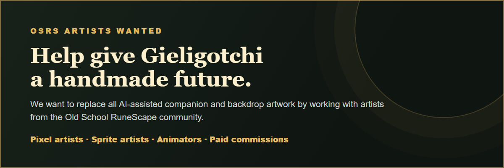](https://discord.gg/dP9WN62QQE)

  <strong>Are you a pixel artist, sprite artist or animator?</strong> 
  Help us replace every AI-assisted asset with commissioned work from the OSRS art community.  
  <a href="https://discord.gg/dP9WN62QQE"><strong>Talk to us on Discord →</strong></a>

---

  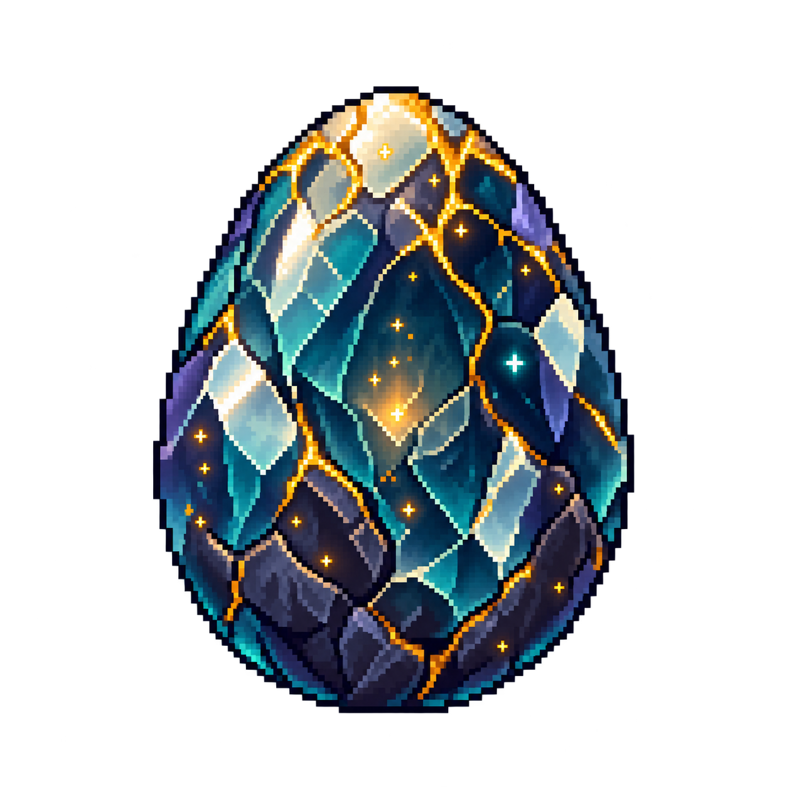

<h2 align="center">A tiny life in Gielinor.</h2>

  Your adventures. Their little world. 
  Hatch, raise and remember a companion while you play Old School RuneScape.

  <a href="https://gieligotchi.com/"><strong>Website</strong></a> ·
  <a href="https://discord.gg/dP9WN62QQE"><strong>Discord</strong></a> ·
  <a href="#private-fair-and-portable"><strong>Privacy &amp; fair play</strong></a>

  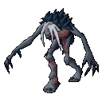
  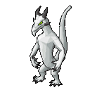
  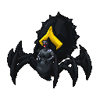
  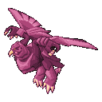
  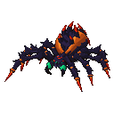

## Your usual adventures. A little more meaning.

A Tamagotchi-style companion without the chores. Nothing decays when you step away. Just pick up where you left off.

| 1. Choose an egg | 2. Play OSRS | 3. Meet your companion | 4. Make memories |
|---|---|---|---|
| Begin with a little mystery. | Skill, fight and finish quests to earn Bonding XP. | Hatch a species, colour and personality. | Build affection, grant wishes and grow your collection. |

 

### A companion with a life of its own

- 71 species, 11 colours and 781 possible combinations
- Individual personalities, wishes and affection
- Account-aware Heartfelt Wishes with specific Gielinor tasks, substantial rewards and free passing
- Per-companion memory journals available through Collection > Memories
- Animated egg hatching, skilling incubation goals and cosmetic rewards
- A 10% Bonding XP boost while a toy is equipped, plus companion level-up celebrations
- Compact sidebar, movable overlay and optional character-save sync

## Familiar places. Smaller adventures.

Collect interpretations of recognisable Gielinor locations and give your active companion a little place to call home.

| Wilderness | Morytania | Prifddinas | Ice Wolf Mountain |
|---|---|---|---|
| 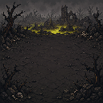 | 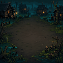 | 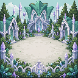 | 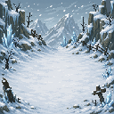 |

 

## Private, fair and portable

> **Your save belongs to your character.** Progress is kept locally first. If you sign into RuneLite, Gieligotchi can sync character-specific snapshots through RuneLite's configuration service. Full export/import and local recovery copies remain available.

Gieligotchi never asks for RuneScape credentials, contacts a separate Gieligotchi server, automates input or changes your character, items, XP, drops or in-game pet ownership. It provides no gameplay advantage.

## Community

Visit **[gieligotchi.com](https://gieligotchi.com/)** for the full companion showcase, rarity information and project updates, or **[join the Discord](https://discord.gg/dP9WN62QQE)** to share feedback, report an issue or discuss artwork commissions.

---

Companion and backdrop artwork was created specifically for Gieligotchi with AI-assisted tools. Our goal is to replace all AI-assisted imagery with commissioned work by OSRS artists.

The idea of rewarding ordinary play with a companion collection was inspired by [OSRS TCG](https://github.com/Azderi/osrs-tcg) by Az. Gieligotchi is independently designed and implemented and does not use OSRS TCG code or artwork.

Heartfelt Wish collection-hunt groups and prerequisite ideas were adapted from [Xtreme Tasker](https://github.com/AmTrollin/xtreme-tasker-osrs) by AmTrollin under its BSD 2-Clause licence. Gieligotchi uses its own task selection, progression, reward and interface systems.

Gieligotchi is an independent community project and is not affiliated with or endorsed by Jagex or RuneLite. Old School RuneScape and related assets belong to their respective owners. Released under the [BSD 2-Clause License](LICENSE).
